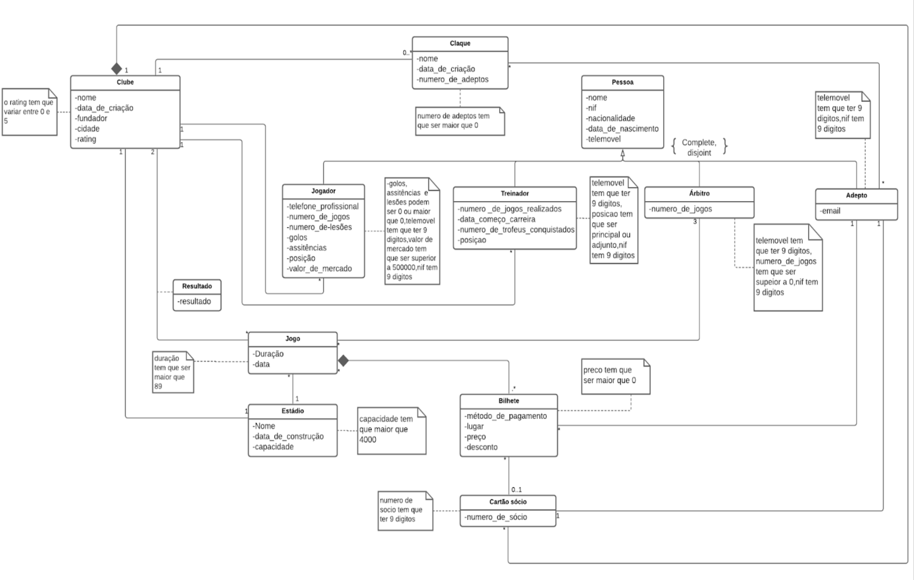

## Liga Bwin

Pretende-se criar uma base de dados de forma a gerir um site relativo à liga portuguesa de futebol. Nesta base de dados existem diversas pessoas caracterizadas por nome, nif, nacionalidade, data de nascimento e telemóvel, desempenhando o papel de adeptos, treinadores, árbitros e jogadores sendo que os adeptos estão associados a um cartão sócio, que tem um número de sócio único para cada cartão, cartão esse que estará associado a um clube e a um ou mais bilhetes. Um clube tem nome, data de criação, fundador, cidade e rating e os bilhetes têm um método de pagamento, lugar , preço e desconto. Os adeptos têm um email e estão associados aos jogos da liga através da compra de bilhetes. Os treinadores e jogadores pertencem a um clube, tendo os jogadores um valor de mercado, posição, golos, assistências , lesões e número de jogos, os treinadores têm uma posição, número de troféus ganhos e número de jogos realizados enquanto que inevitavelmente os árbitros, que são caracterizados por ter um determinado número de jogos estarão associados aos jogos da liga, jogos esse que têm uma determinada duração e data. Os jogos são realizados em diferentes estádios, estádios
esses que têm um nome, data de construção e capacidade e que pertencem sempre a um único clube. Um jogo da liga está associado a dois clubes, sendo que esta associação é caracterizada pelo resultado do jogo entre os dois clubes em questão, servindo assim de histórico relativamente a todos os jogos passados da liga. Os clubes podem ter diversas claques, claques essas que têm um nome , data de criação e são compostas por adeptos.

